# gml4dart: Architecture

## Architekturziele

Die Architektur soll fünf Anforderungen gleichzeitig erfüllen:

- robuste GML-Verarbeitung in reinem Dart
- saubere Modellierung von Geometrien, Features und Coverage-Typen
- klare Trennung zwischen Core, I/O, Interop und späterer Validierung
- kontrollierte Erweiterbarkeit für WFS-, WCS- und OWS-nahe Anwendungsfälle
- praktikable Strategie für große FeatureCollection-Dokumente ohne das Core-API
  zu überversprechen

Die zentrale Entscheidung ist deshalb:

Der fachliche Kern bleibt plattformneutral, enthält keine `dart:io`-Abhängigkeit
und stellt eine dokumentzentrierte Parse-API auf Basis eines Result-Typs bereit.

Zusätzliche Architekturentscheidungen:

- v1 startet mit einem Pure-Dart-Core-Package `gml4dart`
- die öffentliche Core-API ist `GmlDocument.parse...`, nicht `GmlParser` als
  primäres User-Facing-API
- Parse-Fehler werden als `GmlParseIssue` in `GmlParseResult` modelliert, nicht
  als fachliche Exceptions
- GeoJSON und WKT bleiben als leichte Pure-Dart-Interop im Core
- Datei-, HTTP- und andere Transportquellen bleiben außerhalb des Core
- Streaming wird in v1 nicht als generische Dokument-API versprochen, sondern
  als spezialisierter Parserpfad für große WFS-/FeatureCollection-Dokumente
- GML-XML-Erzeugung (Schreiben) ist kein Ziel von v1; die Bibliothek ist rein
  lesend

## Architekturübersicht

Die Bibliothek wird in Schichten aufgebaut.

1. XML Input
   - Einlesen von GML aus String oder Bytes im Core; Datei- und HTTP-Zugriff
     leben in optionalen Adapter-Packages
2. Parsing
   - XML-Knoten in Domain-Objekte und Parse-Diagnostics überführen
3. Domain Model
   - typisierte GML-Datenstrukturen für Geometrien, Features und Coverages
4. Interop
   - Transformation des Core-Modells in GeoJSON, WKT und später weitere Formate
5. Spezialmodule
   - OWS Exceptions, WCS Request Builder, WCS Capabilities Parser,
     Coverage-Helfer und Coverage-Generator
6. Optionales I/O
   - Datei-/URL-Helfer und später plattformspezifische Validierungsintegration

## System-Architektur

```mermaid
graph TB
    subgraph "Input-Layer"
        XmlString[GML XML String]
        XmlBytes[Bytes / HTTP Response]
        OptionalIo[Optional IO Adapters]
    end

    subgraph "Parsing-Layer"
        GmlDocumentApi[GmlDocument Parse API]
        GmlParser[GmlParser]
        GeometryParser[Geometry Parser]
        FeatureParser[Feature Parser]
        CoverageParser[Coverage Parser]
        XmlHelpers[XML Helpers]
        FeatureStreamParser[GmlFeatureStreamParser]
    end

    subgraph "Core Domain"
        GmlDocumentModel[GmlDocument]
        ParseResultModel[GmlParseResult]
        ParseIssueModel[GmlParseIssue]
        GeometryModel[GmlGeometry]
        FeatureModel[GmlFeature]
        FeatureCollectionModel[GmlFeatureCollection]
        CoverageModel[GmlCoverage]
        ExtensionModel[Extensions / Unsupported Nodes]
    end

    subgraph "Interop-Layer"
        GeoJsonInterop[GeoJsonBuilder]
        WktInterop[WktBuilder]
        OptionalInterop[Optional Future Builders]
    end

    subgraph "Special Modules"
        Ows[OWS Exception Module]
        WcsBuilder[WCS Request Builder]
        WcsCapabilities[WCS Capabilities Parser]
        CoverageGenerator[Coverage Generator]
        GeoTiff[GeoTIFF Metadata Helpers]
    end

    XmlString --> GmlDocumentApi
    XmlBytes --> GmlDocumentApi
    OptionalIo --> GmlDocumentApi

    GmlDocumentApi --> GmlParser
    GmlParser --> GeometryParser
    GmlParser --> FeatureParser
    GmlParser --> CoverageParser
    GmlParser --> XmlHelpers
    FeatureStreamParser --> FeatureParser
    FeatureStreamParser --> XmlHelpers

    GmlParser --> ParseResultModel
    ParseResultModel --> GmlDocumentModel
    GmlParser --> ParseIssueModel
    GeometryParser --> GeometryModel
    FeatureParser --> FeatureModel
    FeatureParser --> FeatureCollectionModel
    CoverageParser --> CoverageModel
    GmlParser -.-> ExtensionModel

    GmlDocumentModel --> GeoJsonInterop
    GmlDocumentModel --> WktInterop
    GmlDocumentModel --> OptionalInterop
    GeometryModel --> GeoJsonInterop
    GeometryModel --> WktInterop
    FeatureModel --> GeoJsonInterop

    XmlString -.-> Ows
    XmlString -.-> WcsCapabilities
    CoverageModel -.-> WcsBuilder
    CoverageModel --> CoverageGenerator
    CoverageModel --> GeoTiff
```



## Komponenten-Übersicht

### 1. Input-Layer

- XML als `String` aus eingebettetem Material, Tests oder bereits geladenen
  Quellen
- byte-basierte Eingaben für lokale oder entfernte GML-Dokumente
- optionale spätere Adapter-Packages für Datei, HTTP oder andere Laufzeitquellen

### 2. Parsing-Layer

| Komponente | Zweck | Verwendung |
|------------|-------|------------|
| `GmlDocument.parse*` | öffentliche Core-Einstiegspunkte | String oder Bytes einlesen |
| `GmlParser` | zentrale Orchestrierung | XML-Dokument analysieren und Modell aufbauen |
| `GeometryParser` | Geometrieelemente | `Point`, `LineString`, `Polygon`, `Envelope`, `Curve`, `Surface`, `Multi*` |
| `FeatureParser` | Feature-Elemente | `featureMember`, `member`, FeatureCollection |
| `CoverageParser` | Coverage-Elemente | `RectifiedGridCoverage`, `GridCoverage`, `ReferenceableGridCoverage` |
| `xml_helpers` | Namespace- und Knotenlogik | wiederverwendbare XML-Helfer |
| `GmlFeatureStreamParser` | spezialisierter Streaming-Pfad | große WFS-/FeatureCollection-Dokumente |
| `gml4dart_io` | optionales Folgepaket | Datei-, HTTP- und andere Transportquellen |

### 3. Domain-Layer

- typisierte Repräsentation von GML-Strukturen
- Fokus auf stabilen Dart-Typen statt XML-Daten in höheren Schichten
- Erweiterungspunkte für unbekannte oder nicht unterstützte XML-Knoten

### 4. Interop-Layer

- exportiert nutzbare GeoJSON- und WKT-Repräsentationen aus dem Core-Modell
- hält Ausgabeformate von der Parse-Schicht getrennt
- erlaubt später zusätzliche Builder ohne Eingriff in die Parse-API

### 5. Spezialmodule

- OWS Exception Reports separat von normalem GML-Parsing
- WCS Request Building und Capabilities Parsing als fachlich eigene Module
- Coverage-Helfer wie GeoTIFF-Metadaten und später Coverage-Generator

## Schichten im Detail

### 1. XML Input

Verantwortung:

- XML aus `String` oder Bytes einlesen
- Encoding-Probleme abfangen
- Root-Dokument in die Parse-Orchestrierung überführen

Fehlerbehandlung:

Fehler im Core-Input-Layer werden als `GmlParseIssue` im `GmlParseResult`
gemeldet, nicht als fachliche Exception. Exceptions werden nur bei
Programmierfehlern oder unerwarteten Laufzeitfehlern verwendet.

Transportfehler in optionalen Adapter-Packages sind davon getrennt. Ein
späteres Package wie `gml4dart_io` soll Datei-, Netzwerk- oder HTTP-Fehler
nicht in `GmlParseIssue` umbiegen, sondern als eigenen Load-Fehlerkanal
modellieren.

- ungültiges XML: `GmlParseIssue` mit Severity `error`, `document` ist `null`
- ungültiges Encoding: `GmlParseIssue` mit Severity `error`
- unbekannter oder unerwarteter Root-Knoten: `GmlParseIssue` mit Severity
  `error`

Vorgesehene API:

```dart
final result = GmlDocument.parseXmlString(xml);
final result = GmlDocument.parseBytes(bytes);

// Optionaler Adapter in `gml4dart_io`:
final result = await GmlIo.parseFile(path);
```

Technische Empfehlung:

- `package:xml` (>= 6.0.0) für den DOM-basierten Core-Parser
- `package:xml/xml_events.dart` nur für einen echten Streaming-Pfad
- keine Pflichtabhängigkeit auf `dart:io` im Core
- keine weiteren externen Dependencies im Core außer `package:xml` und
  `package:collection`

### 2. Parsing

Verantwortung:

- XML in typsichere GML-Modelle transformieren
- Namespaces und Versionsvarianten behandeln
- unbekannte oder nicht unterstützte Elemente diagnostizieren
- Root-Typen wie Geometrie, FeatureCollection und Coverage erkennen

Parser-Regeln:

- bekannte Root-Typen explizit unterscheiden, statt alles in einen losen
  Objektbaum zu kippen
- unbekannte Elemente nicht still verlieren
- Parse-Diagnostics mit Pfad- und Kontextinformation zurückgeben
- Parser und spätere fachliche Validierung nicht vermischen

#### 2.1 DOM-Pfad

Der v1-Core-Parser arbeitet DOM-basiert.

Ablauf:

1. XML per `XmlDocument.parse(...)` einlesen
2. Root-Element erkennen
3. Version und Namespace-Kontext ableiten
4. geeigneten Teilparser aufrufen
5. `GmlParseResult` mit Dokument und Issues zurückgeben

Dieser Pfad ist für kleine und mittlere Dokumente die Referenzimplementierung.

#### 2.2 Streaming-Pfad

Streaming ist im MVP kein generischer Ersatz für `parseXmlString` oder
`parseBytes`.

Stattdessen gilt:

- kein öffentliches `GmlDocument.parseAsyncStream(Stream<List<int>>)` in v1
- separater `GmlFeatureStreamParser`
- Scope auf große WFS-/FeatureCollection-artige Dokumente begrenzt
- direkte inkrementelle Erzeugung von `GmlFeature`-Objekten

Motivation:

- GML ist nicht generell in unabhängige, beliebig streambare Einheiten zerlegbar
- für große WFS-Responses gibt es aber natürliche Grenzen wie `featureMember`
  oder `member`
- genau dort bringt Streaming einen realen Speichergewinn

Ein bloßer Komfort-Wrapper, der den Stream komplett einsammelt und anschließend
den DOM-Parser aufruft, zählt nicht als echter Streaming-Pfad und ist kein
MVP-Ziel.

Wiederverwendung:

Der `GmlFeatureStreamParser` soll so weit wie möglich denselben
`GeometryParser` und `FeatureParser` nutzen wie der DOM-Pfad. Die
Teilparser arbeiten dafür auf `XmlElement`-Ebene, nicht auf Dokumentebene. Der
Streaming-Parser baut per Event-API einzelne `XmlElement`-Fragmente auf und
übergibt sie an die gleichen Teilparser. Ein gemeinsames Interface ist dafür
nicht nötig, solange die Teilparser nur `XmlElement` als Eingabe erwarten.

### 3. Domain Model

Das Domain-Modell bildet die fachliche Mitte der Bibliothek.

Ziele:

- stabile Dart-Typen
- keine stringly-typed `type`-Felder als primärer Mechanismus
- Immutable-Modelle
- gute Erweiterbarkeit für weitere GML-Dialekte

#### Typhierarchie

Gemeinsame Basisklasse für alle GML-Knoten:

```dart
sealed class GmlNode {
  const GmlNode();
}
```

Alle Geometrien, Features und Coverages erben transitiv von `GmlNode`. Dies
erlaubt z. B. generische Visitor-Patterns oder Container, die verschiedene
GML-Typen aufnehmen.

#### Empfohlene Kern-Typen

Dokument und Root:

- `GmlDocument` — Dokument-Hülle, kapselt genau ein Root-Objekt
- `GmlRootContent` — sealed Union der möglichen Root-Typen (`GmlGeometry`,
  `GmlFeature`, `GmlFeatureCollection`, `GmlCoverage`)

Versionen:

- `GmlVersion` — Enum mit den Werten `v2_1_2`, `v3_0`, `v3_1`, `v3_2`, `v3_3`

Geometrien:

- `GmlGeometry` — sealed Basisklasse, enthält `version` und `srsName`
- `GmlPoint`
- `GmlLineString`
- `GmlLinearRing`
- `GmlPolygon`
- `GmlEnvelope` — GML 3 Bounding-Box
- `GmlBox` — GML 2.1.2 Bounding-Box (semantisch äquivalent zu `GmlEnvelope`,
  aber mit abweichender XML-Struktur; wird intern auf dasselbe Modell gemappt
  oder als eigener Typ geführt, je nach Bedarf an Roundtrip-Treue)
- `GmlCurve`
- `GmlSurface`
- `GmlMultiPoint`
- `GmlMultiLineString`
- `GmlMultiPolygon`

Features:

- `GmlFeature`
- `GmlFeatureCollection`

Coverages:

- `GmlCoverage` — Basisklasse
- `GmlRectifiedGridCoverage`
- `GmlGridCoverage`
- `GmlReferenceableGridCoverage`
- `GmlMultiPointCoverage`

Extensions:

- `GmlUnsupportedNode` — Platzhalter für XML-Knoten, die der Parser erkennt,
  aber nicht in ein typisiertes Modell überführen kann. Enthält den
  Namespace-URI, den lokalen Namen und optional den Roh-XML-Inhalt. Damit
  gehen unbekannte Elemente nicht still verloren und können in
  Parse-Diagnostics referenziert werden.

#### Koordinaten-Modell

Entscheidung: Koordinaten werden als `GmlCoordinate`-Record modelliert, nicht
als `List<double>`.

```dart
/// Einzelne Koordinate mit optionaler Höhe und Maßzahl.
final class GmlCoordinate {
  const GmlCoordinate(this.x, this.y, [this.z, this.m]);

  final double x;
  final double y;
  final double? z;
  final double? m;

  int get dimension => switch ((z, m)) {
    (null, null) => 2,
    (_, null) || (null, _) => 3,
    _ => 4,
  };
}
```

Regeln:

- `GmlPoint` enthält genau eine `GmlCoordinate`
- `GmlLineString` enthält `List<GmlCoordinate>`
- GML-2-`<coordinates>`-Syntax und GML-3-`<pos>`/`<posList>`-Syntax werden
  beide auf `GmlCoordinate` normalisiert
- der Parser erkennt die Dimension aus `srsDimension` oder aus der Anzahl
  der Werte

#### Feature-Properties

Entscheidung: Feature-Properties werden als `Map<String, GmlPropertyValue>`
modelliert.

```dart
sealed class GmlPropertyValue {
  const GmlPropertyValue();
}

final class GmlStringProperty extends GmlPropertyValue {
  const GmlStringProperty(this.value);
  final String value;
}

final class GmlNumericProperty extends GmlPropertyValue {
  const GmlNumericProperty(this.value);
  final num value;
}

final class GmlGeometryProperty extends GmlPropertyValue {
  const GmlGeometryProperty(this.geometry);
  final GmlGeometry geometry;
}

final class GmlNestedProperty extends GmlPropertyValue {
  const GmlNestedProperty(this.children);
  final Map<String, GmlPropertyValue> children;
}

final class GmlRawXmlProperty extends GmlPropertyValue {
  const GmlRawXmlProperty(this.xmlContent);
  final String xmlContent;
}
```

Regeln:

- jeder GML-Property-Knoten wird auf einen passenden `GmlPropertyValue`-Typ
  gemappt
- Geometry-Properties werden erkannt und als `GmlGeometryProperty` typisiert
- verschachtelte Strukturen werden als `GmlNestedProperty` abgebildet
- nicht klassifizierbare Inhalte werden als `GmlRawXmlProperty` aufbewahrt
- `GmlFeature` enthält `Map<String, GmlPropertyValue> properties`

#### GmlDocument-Root

`GmlDocument` kapselt genau ein Root-Objekt:

```dart
final class GmlDocument {
  const GmlDocument({
    required this.version,
    required this.root,
    this.boundedBy,
  });

  final GmlVersion version;
  final GmlRootContent root;
  final GmlEnvelope? boundedBy;
}
```

`GmlRootContent` ist eine sealed Union:

```dart
sealed class GmlRootContent {
  const GmlRootContent();
}
// GmlGeometry, GmlFeature, GmlFeatureCollection und GmlCoverage
// implementieren GmlRootContent.
```

Damit sind Geometrie-, Feature- und Coverage-Dokumente alle sauber abgebildet.

### 4. Fehlermodell

Das Fehlermodell trennt Parse-Diagnostics von Laufzeit-Exceptions.

Vorgesehene Typen:

```dart
final class GmlParseResult {
  const GmlParseResult({
    this.document,
    this.issues = const [],
  });

  final GmlDocument? document;
  final List<GmlParseIssue> issues;

  bool get hasErrors;
}
```

```dart
final class GmlParseIssue {
  const GmlParseIssue({
    required this.severity,
    required this.code,
    required this.message,
    this.location,
  });

  final GmlIssueSeverity severity;
  final String code;
  final String message;
  final String? location;
}
```

Regeln:

- fehlerhaftes XML wird als `error` berichtet
- unbekannte, aber tolerierbare Elemente werden als `warning` oder `info`
  erfasst
- nicht unterstützte bekannte GML-Konstrukte werden nicht still ignoriert
- `document == null` bedeutet, dass der Parse-Vorgang nicht erfolgreich
  abgeschlossen werden konnte

Abgrenzung:

- OWS Exception Reports sind ein separates fachliches Thema
- Transportfehler sind kein Parse-Issue-Thema
- spätere Validierungsregeln werden nicht in `GmlParseIssue`, sondern in ein
  separates Validierungsmodell gehören

### 5. Namespace- und Versionsbehandlung

GML tritt in mehreren Versionen und Namespace-Varianten auf. Diese Logik darf
nicht verteilt in Einzelparsern repliziert werden.

Deshalb braucht der Parser eine zentrale Namespace-/Versionsstrategie:

- Root-Namespaces auslesen
- bekannte GML-Versionen erkennen
- `gml`, `wfs` und weitere relevante Präfixe nicht über feste Prefix-Namen,
  sondern über Namespace-URIs behandeln
- Hilfsfunktionen für `localName`, Namespaces und Kindelementsuche zentral
  bereitstellen

Versionen im Scope:

- GML 2.1.2
- GML 3.0 / 3.1
- GML 3.2
- GML 3.3 nur soweit für Parsing realistisch und durch Fixtures gedeckt

### 6. Interop

Der Interop-Layer übersetzt das rohe Domain-Modell in nutzbare Zielformate.

v1 im Core:

- GeoJSON
- WKT

später:

- CSV
- CoverageJSON
- CIS JSON
- FlatGeobuf
- KML

Wichtig:

Der Builder-Layer konsumiert das Core-Modell. Er formt nicht die Parse-API und
kennt keine Transportquellen.

### 7. Spezialmodule

#### OWS Exception Module

Aufgaben:

- OWS Exception Reports erkennen
- strukturiertes Modell bereitstellen
- nicht mit dem normalen GML-Parse-Ergebnis vermischen

#### WCS Request Builder

Aufgaben:

- GetCoverage-Requests aus Dart-Modellen aufbauen
- Versionen sauber typisieren
- URL- und XML-basierte Varianten unterstützen

#### WCS Capabilities Parser

Aufgaben:

- GetCapabilities-Dokumente auswerten
- Service- und Coverage-Metadaten extrahieren
- WCS-Versionen typisiert zurückgeben

#### Coverage-Helfer

Aufgaben:

- GeoTIFF-relevante Metadaten aus Coverage-Modellen ableiten
- Koordinaten- und Rasterhilfen bereitstellen

## Empfohlene Paketstruktur

```text
gml4dart/
  lib/
    gml4dart.dart
    src/
      model/
        gml_node.dart
        gml_document.dart
        gml_root_content.dart
        gml_version.dart
        gml_coordinate.dart
        gml_geometry.dart
        gml_feature.dart
        gml_feature_collection.dart
        gml_property_value.dart
        gml_coverage.dart
        gml_unsupported_node.dart
        gml_parse_result.dart
        gml_parse_issue.dart
      parser/
        gml_parser.dart
        geometry_parser.dart
        feature_parser.dart
        coverage_parser.dart
        xml_helpers.dart
        streaming/
          gml_feature_stream_parser.dart
      interop/
        geojson/
          geojson_builder.dart
        wkt/
          wkt_builder.dart
      ows/
        ows_exception.dart
      wcs/
        request_builder.dart
        capabilities_parser.dart
      generators/
        coverage_generator.dart
      utils/
        geotiff_metadata.dart
  test/
    fixtures/
    parser/
    interop/
    wcs/
    streaming/
```

## Teststrategie

Die Architektur ist nur belastbar, wenn sie mit echten GML-Dokumenten abgesichert
wird.

Mindestens:

- Unit-Tests pro Geometrie-Parser
- Root-Dispatch-Tests für Geometrie, FeatureCollection und Coverage
- Namespace-Varianten
- GML 2.1.2 / 3.x Fixtures
- Fehlerfälle mit ungültigem XML oder unbekanntem Root
- Streaming-Tests mit künstlichen Chunk-Grenzen
- Builder-Tests für GeoJSON und WKT
- Coverage-Tests mit realistischen Rasterbeispielen

Fixture-Quellen:

- `/Development/s-gml/test/gml/`
- kleine gezielt konstruierte Inline-Fixtures
- später echte WFS-/WCS-Responses

## Architekturentscheidungen für v1

- Core-Package ohne `dart:io`
- dokumentzentrierte Parse-API
- Result-basiertes Fehlermodell
- DOM-Pfad als Standard
- spezialisierter statt generischer Streaming-Pfad
- GeoJSON und WKT im Core
- OWS/WCS als getrennte Fachmodule
- Transport und spätere XSD-Validierung außerhalb des Core
- GML-XML-Erzeugung (Schreiben) ist kein v1-Ziel
- Koordinaten als `GmlCoordinate`-Record, nicht als `List<double>`
- Feature-Properties als `Map<String, GmlPropertyValue>`
- `GmlNode` als gemeinsame Basisklasse aller GML-Knoten

